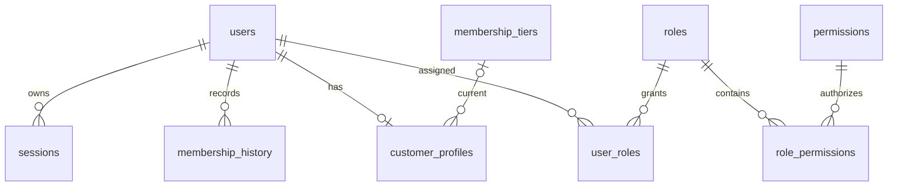
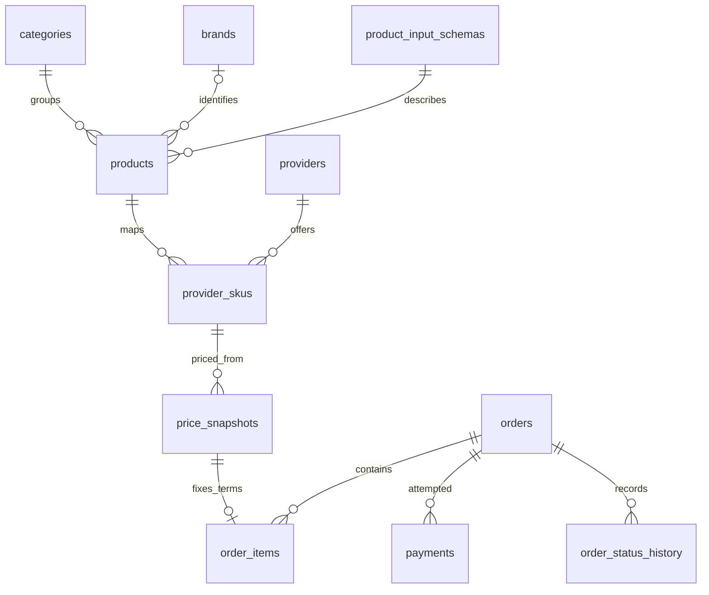
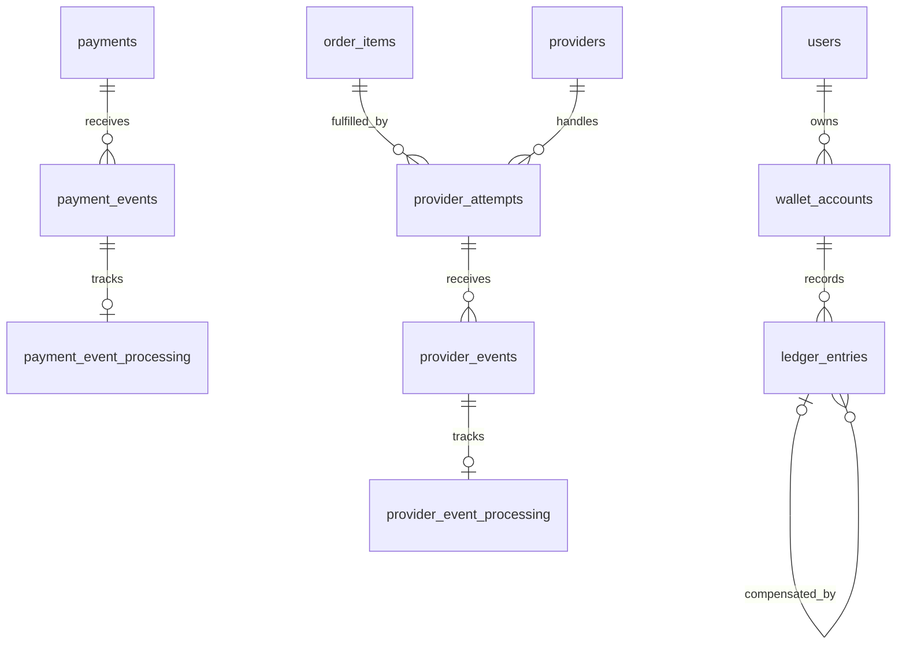
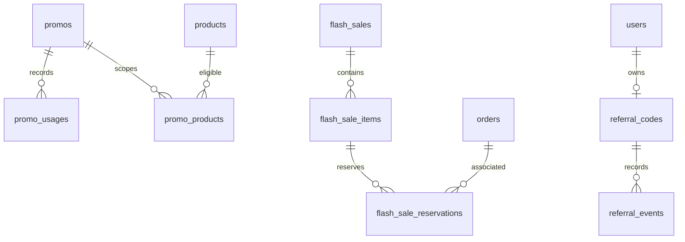

# TOPUPLAB domain model — Phase 3

Phase 3 defines persistence only. It adds 47 tables to the existing foundation table, with no business records, API integrations, business services, or UI changes. PostgreSQL 17 and Drizzle remain the accepted persistence stack.

## Organization and inventory

`src/server/db/schema.ts` remains the single Drizzle entry point. Domain modules import in one direction: identity/catalog → providers/pricing → orders → payments/fulfillment/wallet → promotions/referrals/operations. Self-references stay inside their table definitions. SQL foreign keys are authoritative; a second ORM relation graph is unnecessary until relational queries need one.

| Module      | Tables                                                                                                                                           |
| ----------- | ------------------------------------------------------------------------------------------------------------------------------------------------ |
| auth        | users, password_credentials, sessions, roles, permissions, user_roles, role_permissions, customer_profiles, membership_tiers, membership_history |
| catalog     | categories, brands, products, product_input_schemas                                                                                              |
| providers   | providers, provider_skus, provider_health, provider_syncs                                                                                        |
| pricing     | pricing_rules, price_snapshots                                                                                                                   |
| orders      | orders, order_items, order_status_history                                                                                                        |
| payments    | payments, payment_events, payment_event_processing                                                                                               |
| fulfillment | provider_attempts, provider_events, provider_event_processing                                                                                    |
| wallet      | wallet_accounts, ledger_entries                                                                                                                  |
| promotions  | promos, promo_products, promo_categories, promo_tiers, promo_usages, snapshot_promos, flash_sales, flash_sale_items, flash_sale_reservations     |
| referrals   | referral_codes, referral_events                                                                                                                  |
| operations  | notifications, audit_logs, admin_notes, cms_banners, system_settings                                                                             |

`enums.ts` owns stable state vocabularies; `shared.ts` owns column conventions; `validation.ts` owns strict JSON input definitions. Types derive from Drizzle (`typeof orders.$inferSelect` / `$inferInsert`) and Zod. There are no duplicate hand-maintained entity interfaces.

## Identity and time

Entity IDs use PostgreSQL-generated UUIDv4, supported by the accepted PostgreSQL 17 baseline. Orders also have a separate unique random UUID public reference; provider attempts have their own immutable unique UUID reference. Random identifiers reduce enumeration but never replace authorization. Junction tables use composite primary keys. There are no sequential public identifiers.

All instants use `timestamptz`; applications should exchange ISO timestamps and format them in the viewer's timezone. Mutable records have created/updated timestamps, with database triggers maintaining `updated_at`. History rows have creation, receipt, or occurrence instants without a misleading update timestamp. The historical foundation table retains its original behavior.

Users require normalized email and/or E.164 phone; each has independent uniqueness and verification timestamps. Password credentials are separate and accept an Argon2id encoding prefix; hashing and complete encoding verification still belong to future authentication. Sessions retain only a SHA-256 token digest, expiry and revocation information. No authentication flow is implemented.

Roles and permissions are relational data. Membership names, codes, levels and benefits are configurable rows, not enum values. A profile holds current membership; append-only membership history records changes. Future membership writes must update both atomically.

## Money, percentages and immutable terms

Every `_idr` column uses PostgreSQL `bigint` with Drizzle's JavaScript `bigint` mode. `20500n` means Rp20.500. This provides room beyond a 32-bit integer without unsafe JavaScript number conversion. API boundaries must serialize money as decimal strings and explicitly parse/validate it; never use `Number()` for arbitrary database money. PostgreSQL's signed 64-bit range is the storage limit. Public validation accepts nonnegative amounts up to 9,223,372,036,854,775,807. Signed markup and expected margin allow an explicitly visible loss; a future pricing policy must decide whether to reject it.

Percentages use integer basis points: 100 = 1%, 10,000 = 100%. Health rates and percentage discounts are bounded to 0–10,000. Markup permits 0–100,000 (0–1,000%). Future multiplication/division must use integer arithmetic with an explicit rounding policy. No pricing execution or rounding implementation is added here. Exact `numeric` casts inside SQL checks prevent intermediate bigint overflow; stored money remains integer bigint. See [PostgreSQL numeric types](https://www.postgresql.org/docs/17/datatype-numeric.html).

Each immutable price snapshot represents one unit's commercial terms:

- Final amount = tier price − promo discount + customer payment fee.
- Markup amount = tier price − provider cost.
- Expected gross margin = final amount − provider cost − gateway cost − cashback.
- Discount cannot exceed tier price; monetary inputs other than markup/margin are nonnegative.
- Order item line total = unit final amount × positive quantity.

Snapshot rule/tier/provider labels and external SKU survive later catalog edits. `snapshot_promos` records applied promo identities and amounts. A composite foreign key binds each item to the snapshot's product and final unit amount. A composite foreign key binds a payment to its order's currency and total: the initial model supports full-order payments, not split tender. Order totals, contacts, item terms and payment amounts cannot be rewritten by ordinary updates after insertion. Future drafts therefore collect editable choices before persisting an immutable commercial order, or cancel and create a replacement.

**Cross-row invariants remain future transactional responsibilities:** order total equals the sum of its items; applied promo amounts match snapshot totals; no second settlement of the same order; state transitions are valid; history is written alongside the current state. SQL checks cannot safely substitute for cross-row concurrency control. See [PostgreSQL constraints](https://www.postgresql.org/docs/17/ddl-constraints.html).

## Providers, events and idempotency

Products are customer-facing identities; provider SKUs are supply mappings. `(provider_id, external_sku)` is unique across products. Composite foreign keys ensure snapshots and attempts cannot mix a SKU with the wrong provider/product, and an attempt cannot point to another order's item.

Provider health is an append-only observation stream, queried by provider and latest checked time. The provider row also stores an operator-controlled operational state. Observation rates use basis points; a future integration must define the measurement window. Sync rows record counts, state, correlation and safe error codes, not raw response dumps.

Order states are exactly: DRAFT, WAITING_PAYMENT, PAYMENT_PENDING, PAID, QUEUED, PROCESSING, PROVIDER_PENDING, SUCCESS, FAILED, EXPIRED, REFUND_PENDING, REFUNDED, MANUAL_REVIEW, CANCELLED. This is vocabulary, not a transition implementation.

Pending provider attempts remain distinct from failed attempts. A partial unique index allows only one CREATED/SUBMITTED/PENDING/SUCCESS attempt per order item; a successful attempt also prevents another fulfillment attempt. Failure/cancellation can permit a later attempt only after future reconciliation establishes that retry is safe. External payment/provider references may be assigned once but cannot subsequently be changed or cleared.

Payment/provider events are immutable normalized records. Separate one-to-one processing rows hold mutable delivery-processing state, retry count and processed timestamp. This preserves event evidence while permitting processing retries.

| Identity                                                                                                      | Uniqueness scope                       |
| ------------------------------------------------------------------------------------------------------------- | -------------------------------------- |
| Order public reference, order idempotency                                                                     | Global per column                      |
| Payment idempotency, attempt reference                                                                        | Global per column                      |
| Payment gateway transaction reference                                                                         | Gateway + non-null reference           |
| Payment webhook event                                                                                         | Gateway + stable event key             |
| Provider transaction reference                                                                                | Provider + non-null reference          |
| Provider callback event                                                                                       | Provider + stable event key            |
| Ledger, membership history, order history, promo usage, reservation, referral event, notification idempotency | Global within each table               |
| Promo usage lifecycle action                                                                                  | Promo + order + action                 |
| Referral registration                                                                                         | One REGISTERED event per referred user |

Idempotency/event keys must be nonblank and at most 200 characters. Future integrations must namespace gateway identities by account/environment when external identities are only account-scoped, and derive stable keys from trusted event identifiers. A unique key is a concurrency backstop, not proof of webhook authenticity. Verification, payload matching, deduplication outcomes and transactional processing remain future work.

## Wallet, promotions and limited inventory

Wallet accounts are unique per user/currency and have no stored balance. Append-only positive ledger amounts combine CREDIT/DEBIT direction and AVAILABLE/RESERVED buckets. A journal UUID groups entries. Available/reserved totals derive from the ledger. Reservation transfers and settlement must use a future atomic transaction locking the wallet account and checking sufficient funds. No balance mutation service or full general-ledger accounting system is implemented.

Corrections add compensating entries with a same-wallet/currency foreign key to the original entry. Order references have a real foreign key; other typed `reference_id` values are polymorphic and must be checked by their future writer. The database does not yet enforce balanced journal sums, correction direction or over-refund limits.

Promos carry type-specific amounts/rates, schedule, quota, user limit, budget, minimum purchase, first-order flag and stacking policy. Product/category/tier scope uses junction tables. An empty scope means unrestricted in that dimension; future eligibility code must define combination semantics explicitly. Usage records append RESERVED/REDEEMED/RELEASED/REVERSED actions. A future transaction should lock the promo row, aggregate effective usage/budget, then append the action and financial snapshot together. Unique action keys prevent duplicate actions, but do not alone enforce eligibility, limits or action ordering. Identified users are necessary when enforcing per-user limits; guest eligibility requires a separately approved identity policy.

Flash-sale items store configured price and quota; reservation rows account for RESERVED/SOLD/RELEASED/EXPIRED quantities. Future code should lock the item row, count reserved plus sold units, enforce global and per-user limits, then insert/transition the reservation atomically. Expiry cannot be inferred from a stale application counter. Reservations currently require an identified user for per-user limits; ordinary orders still support guests. Guest flash-sale participation would require an explicit identity decision before implementation.

Referral codes have one owner. Events retain referrer, optional referred user, qualifying order and reward; self-referral is structurally rejected when the user is known. Qualification and reward policies are not implemented.

## Deletion, history and indexes

All foreign keys explicitly use RESTRICT for deletion and key updates. No cascade is used. Archive/deactivate business rows instead of deleting referenced identities. Application authorization must additionally prevent inappropriate updates to archived or referenced mutable records.

Custom migration `0002_domain_guards.sql` rejects UPDATE, DELETE and TRUNCATE on membership history, input schema versions, health observations, price snapshots, order items, order status history, payment/provider events, ledger entries, promo usages, snapshot promos, referral events, audit logs and admin notes. Mutable financial/processing rows permit only listed lifecycle fields to change and reject DELETE/TRUNCATE. These are ordinary-DML guards, not protection against a database owner disabling triggers. Production should use a separate least-privilege runtime role without DDL rights; provisioning that role is outside this phase. Trigger semantics are described in [PostgreSQL trigger functions](https://www.postgresql.org/docs/17/plpgsql-trigger.html).

Indexes cover unique identities, customer/status order chronology, provider SKU selection, pending attempt checks, provider health/sync chronology, wallet chronology, scoped promo/referral usage, and audit entity chronology. Leading columns follow intended lookup predicates. Junction reverse lookups have supporting indexes. Low-cardinality status columns are generally paired with date/expiry/sort context. No blanket JSON indexes, partitions or speculative indexes on every field are introduced. Production query plans should guide later additions. [Drizzle constraints and indexes](https://orm.drizzle.team/docs/indexes-constraints) describe the generated definitions.

## Privacy, JSON and operations

No game password, government ID, birth date, postal address, card credential or plaintext provider API credential is modeled. Provider configuration stores only an environment/secret-manager reference. Order targets have ciphertext plus a key reference; authenticated encryption, key rotation and safe presentation must be implemented before orders can be written. Contact snapshots contain necessary email/phone and require restricted access. Notifications currently target registered users; guest delivery needs a deliberate future delivery contract.

Strict Zod schemas cover product metadata, descriptive input definitions, tier benefits, provider metadata, safe normalized events, audit metadata and typed settings. Future writers **must parse untrusted JSON before every write or trusted use**. Drizzle `$type` provides TypeScript assistance only; database JSON object checks do not enforce the full Zod contract. Allowlisted fields can still contain sensitive text if a writer misuses them. Never pass raw payloads, headers or exception messages through.

Input fields permit only known target concepts and format names; no password field, executable validator or stored code is accepted. Versioned input definitions are immutable. Money, states, relationships and histories remain relational columns.

System settings permit only PUBLIC_CONTACT (email/optional phone), RECEIPT_COPY (footer) and CATALOG_PAGE_SIZE (12–48). Database shape checks and strict runtime validation both apply. Financial policy, authentication policy and secret storage are excluded. Extending settings requires a reviewed schema/validation migration, not an arbitrary new key.

Audit metadata stores changed field names/reason codes rather than raw before/after personal values. Audit entity IDs are intentionally polymorphic and are not a replacement for financial foreign keys. Admin notes require one explicit order/user/provider/product target and an actor; content moderation, retention and restricted admin access remain future enforcement. CMS stores asset references and local CTA paths, not binary files. No new public/admin routes are exposed.

Privacy retention and erasure procedures require a future reviewed policy: history protection deliberately prevents ordinary deletion, and ciphertext/key retention must be coordinated with financial record retention. Do not promise that archival alone anonymizes personal data.

## Migrations and validation boundary

Preserve `0000_foundation.sql`. Apply generated `0001_domain_model.sql`, custom `0002_domain_guards.sql`, and corrective `0003_key_whitespace_guards.sql` through `npm run db:migrate`. These are journaled additive migrations. Migration 0003 closes the whitespace-only key defect found by live testing without rewriting the earlier files. Do not use schema push as a substitute: Drizzle snapshots do not represent custom trigger functions or guards. `db:check` checks migration consistency; it does not execute SQL or validate trigger behavior.

Repeated generation should report no schema changes and leave migration/snapshot hashes unchanged. Future stable enum additions require migrations; renaming/removing values requires explicit data conversion and dependent-object review. Review generated SQL and retain the custom guards when changing tables.

Schema tests inspect actual Drizzle metadata and exercise runtime validators. The subsequent live PostgreSQL 17.11 run passed 210 checks, including clean/repeat migration, repeated technical seed, constraint violations, trigger update/delete/truncate rejection, permitted lifecycle updates, reference assignment and migration failure recovery. See [live validation and local setup](phase-3-live-validation.md). Repeat this suite against a disposable database when changing database guards; never target a production database.

Phase 4 data and all product, pricing, payment, provider, wallet, promo and referral workflows remain unimplemented by design.
